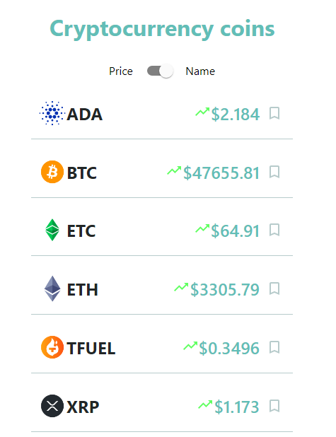
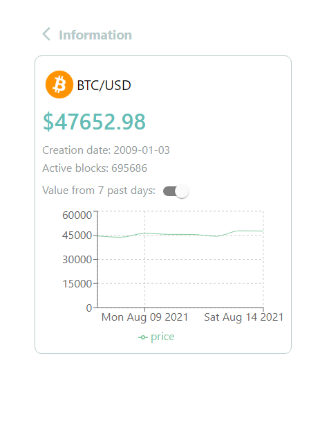

# ✨ ZENGO CODING CHALLENGE 

Create a page that show 5 crypto currencies and related information.
Create a page with the detail of the selected crypto currency.
## 🎨 Preview



[DEMO](https://nicolezimerman.github.io/zengo-challenge/)

## 💻 Technologies
HTML, CSS, REACTJS, MATERIAL UI

## 🚀 Installation

1. Clone project
2. Install the dependencies
```bash
npm install
```

## ⚙️ Usage
1. Go to project directory on the shell cd riverside-challenge
2. Run on the local host npm start This will be open on [http://localhost:3000]
```bash
npm start
```